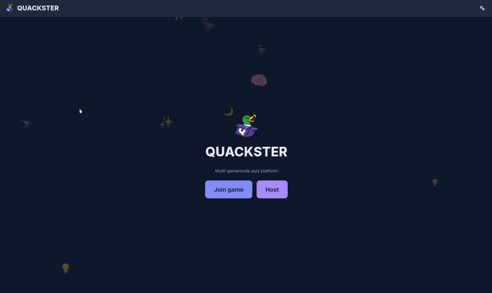
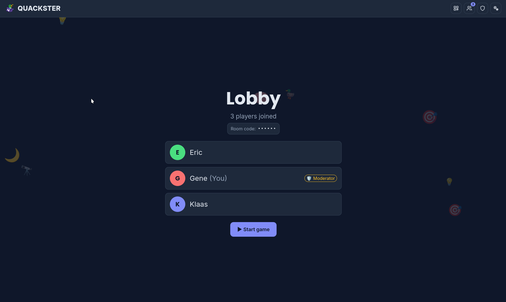
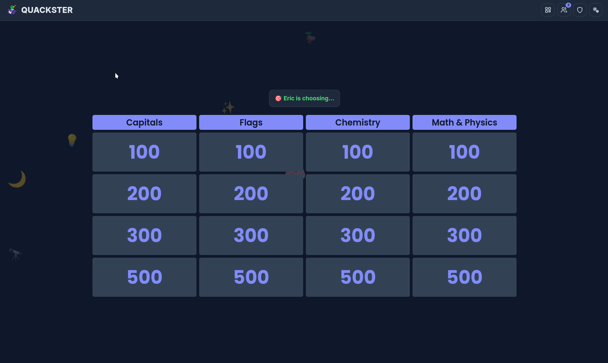

<h1 align="center">
  <br />
  Quackster
</h1>

<p align="center">
  
  
  
  
  
</p>

Self-hostable, multi-gamemode, open quiz platform. Think Kahoot, but
with multiple gamemodes (classic, battle royale, survival, music quiz, jeopardy,
...) that will share a single pool of community-contributed or custom made,
translatable questions.

Content (questions, packs, tags, media) lives in the repo as human or
LLM-editable YAML. A self-hosted instance runs the core game loop **offline**
after setup. Set it up at home, play on LAN or even set up your own hosted instance.

<p align="center">
  
  
  
</p>

## Features

As Quackster is in very early development, not everything is here yet, but you
can already do some things:

- [x] Data structure for different types of questions, question types and languages
- [x] Basic Gameloop (Host, Join, Start, Question, Answer, End)
  - [x] GridQuiz gamemode (like Jeopardy)
  - [ ] Linear gamemode
  - [ ] Different flooring strategies (Open buzzer, Turn-based)
  - [ ] More gamemodes: battle royale, survival, music quiz, who wants to be a
        millionaire, higher or lower, ...
- [x] Media questions (Local/YouTube clips with moderator-controlled playback)
- [x] Translatable question content (German overlays today)
  - [ ] Localized question delivery in-game (play in your language)
- [ ] Game chaining, play multiple games back-to-back in one room
- [ ] Room persistence, rooms survive a server restart
- [x] QR code to join a room
- [ ] Question authoring tools (scaffolding script, editor schema support)
- [ ] Community pack pipeline, share and reuse curated question packs

## Self-hosting

There is no Docker container yet. But if you use Nix you can use our flake:

```sh
nix run github:quacksterparty/quackster#default
```

The server listens on `http://localhost:3000`. Open it in your browser, click
**Host** to create a room, and players join with the room code or QR code.

Planned for easy setup:

- [ ] NixOS service module
- [ ] Docker container + compose file

We want these setups to be as secure as possible. If you find a security
issue, please report it via GitHub's Security tab (private reporting is
enabled).

USE AT YOUR OWN RISK! THIS IS PRE-ALPHA SOFTWARE!

## Adding questions

Questions are plain YAML files in `data/questions/`. There is no authoring
tool yet, the current best way is to ask an LLM to generate a quiz for you
(point it at an existing file in `data/questions/` as a template), then run
`cargo test` in `api/` to check that your questions load correctly.

## Development

My philosophy on programming is that I want as few footguns as I can get, so I
just can't do something stupid. That's why we use Rust and TypeScript, this
gives us a lot of safety while developing, at least that's what I tell myself.

The backend is Rust + axum (`api/`), the frontend is SvelteKit built as a
static site. Shared types are generated from Rust via `ts-rs`. Questions,
packs and tags live as plain YAML in `data/`.

To get started you only need Nix:

```sh
nix develop   # dev shell with everything installed
pnpm dev      # terminal 1: frontend with hot reload
bacon l       # terminal 2: backend, rebuilds on change
```

Before you push, make sure these pass:

```sh
pnpm check    # type checks
pnpm lint     # formatting + eslint
pnpm test     # unit + e2e tests
cargo test    # backend tests (run in api/)
```

For more information about the architecture and past decisions, see the
[`docs/`](docs/) folder.

Contributions are welcome, questions too, open an issue or a PR.

## A note on AI-assisted development

Parts of this codebase were written with the help of LLM coding tools, and I
want to be upfront about that, including the ethics.

I think LLMs are very hard to do ethically. The big models are trained by
scraping enormous amounts of copyrighted material, almost certainly including
countless license violations. At the same time, I believe this technology is
too important to be left solely in the hands of the corporations building it
this way. It should be shaped and used by everybody, so we can find better,
more ethical ways to use and build these tools, not just the ways that big
tech hands us.

What that means for this project:

- I try to use **open models** wherever possible. I've experimented with
  various setups to figure out how to navigate this new landscape. Currently
  I use **MiniMax M3** via their subscription to keep costs low, which lets me
  prototype faster and try things I haven't done before.
- **Every line of code that lands in this codebase is reviewed and revised by
  me.** I use the [pi](https://github.com/earendil-works/pi) coding agent, which
  opens every change in a review tab in Neovim before the agent is allowed to
  continue. Throwaway experiments aside, I can say I understand every line in
  this codebase (at least at the time it was written).
- I've used this project to properly learn Rust. I'm not a Rust pro, but the
  code here is not blindly generated output.
- For the frontend I had a lot of help, as I don't really like to do CSS and
  LLMs are really good at that (most of the times).

If you don't want to use software that had LLMs involved in its creation,
that's a completely valid standpoint and I respect it.

Fuck Anthropic, fuck OpenAI, fuck Google, and fuck Elon Musk.

## License

Licensed under the [EUPL-1.2](LICENSE).
